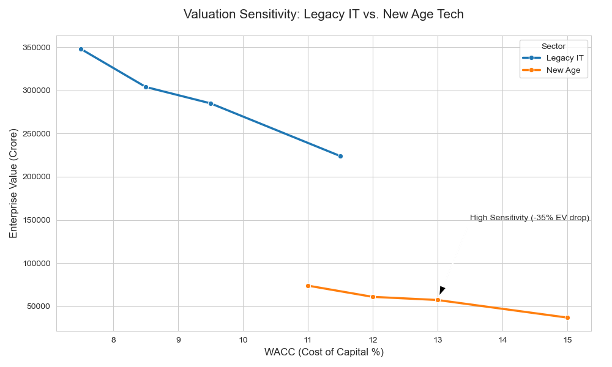

# KRITI 2026: Hybrid Investment Valuation Model
### Quantitative Equity Research & Machine Learning

## 📊 Valuation Sensitivity Analysis

## Overview
This project implements a **Multiple Linear Regression** model to analyze and predict the intrinsic value of Indian Technology firms. It compares stable **Legacy IT** (HCLTech, Wipro) with hyper-growth **New Age Tech** (Eternal/Zomato, Meesho).

## Key Findings (Dimension 6)
- [cite_start]**High Sensitivity:** New Age Tech valuations are significantly more volatile; a 2% increase in WACC reduces Eternal's Enterprise Value (EV) by **-35%**[cite: 209].
- [cite_start]**Stable Returns:** Legacy IT exhibits durable margins; the same 2% WACC increase only impacts HCLTech's EV by **-20%**[cite: 209].
- [cite_start]**Intrinsic Value Anchors:** HCLTech operates as a steady-state cash machine with a base EV of **2,85,006 Cr**, while Eternal is a growth-oriented platform with a base EV of **57,345 Cr**[cite: 194, 208].

## Technical Implementation
- [cite_start]**DCF Engine:** Integrated Gordon Growth and multi-stage DCF logic: $V = \sum \frac{FCF_t}{(1+WACC)^t} + \frac{TV}{(1+WACC)^n}$[cite: 172].
- **Feature Engineering:** Utilized a `StandardScaler` to handle wide-ranging inputs like WACC (7.5%-15%) and Revenue in Crores.
- [cite_start]**Strategic M&A:** Automated screening for value-accretive deals, identifying **Eternal's acquisition of Urban Company** as the top strategic recommendation[cite: 247].

## Tech Stack
- **Python:** Scikit-Learn (Regression), Matplotlib/Seaborn (Visualization).
- **Financial Consulting:** Based on CFA Institute frameworks for KRITI 2026.